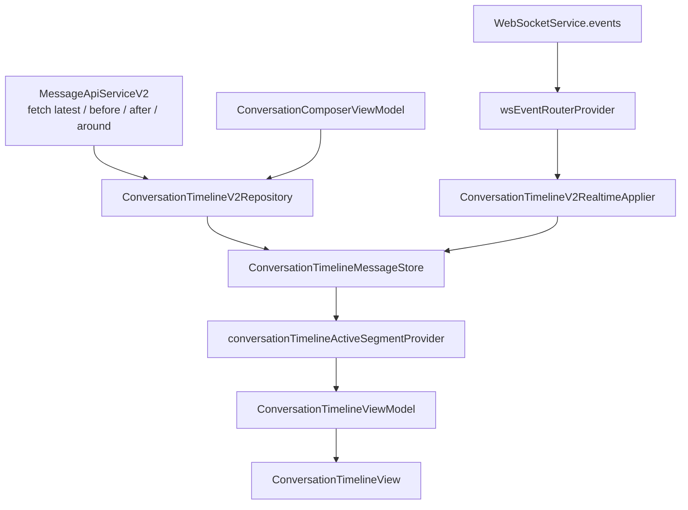

# Conversation V2 Datastore

This document describes the Flutter conversation V2 datastore and how it should align with the shared canonical message timeline model.

## Current Architecture

Flutter already uses the target canonical-segment shape for most conversation timeline behavior. The main state lives in `ConversationTimelineMessageStore`, exposed by `conversationTimelineMessageStoreProvider`.



Key files:

- `lib/features/conversation/shared/application/conversation_canonical_message_store.dart`
- `lib/features/conversation/shared/data/conversation_timeline_v2_repository.dart`
- `lib/features/conversation/shared/data/conversation_realtime_message_applier.dart`
- `lib/features/conversation/timeline/presentation/conversation_timeline_view_model.dart`
- `lib/features/conversation/timeline/presentation/conversation_timeline_view.dart`
- `lib/features/conversation/compose/presentation/conversation_composer_view_model.dart`
- `lib/core/network/ws_event_router.dart`

## Store Shape

The canonical store is keyed by `ConversationIdentity`, which is `(chatId, threadRootId)`.

```dart
typedef ConversationTimelineMessageStoreState =
    Map<ConversationIdentity, ConversationTimelineCanonicalScope>;
```

Each `ConversationTimelineCanonicalScope` contains:

- `segments`: server-backed contiguous message ranges
- `optimisticMessages`: local-only sends waiting for websocket/API confirmation
- `hasReachedLatest`: true when the latest tail is loaded
- `hasReachedOldest`: true when no older history remains

Each `ConversationTimelineCanonicalSegment` contains a non-empty ordered list of server-backed messages. Segment boundaries are derived from `firstServerMessageId` and `lastServerMessageId`.

## Ordering Rules

Flutter orders canonical messages by `serverMessageId`. This is correct because backend message ids are snowflake-style ids: unique and globally ordered.

Rules:

- Server-backed messages belong in canonical segments.
- Canonical segment messages must have `serverMessageId != null`.
- Optimistic messages stay in `optimisticMessages`.
- Optimistic rows use `clientGeneratedId` as their stable identity.
- `ConversationMessageV2.stableKey` prefers `clientGeneratedId`, which keeps the rendered row stable after confirmation.

## Pagination

`ConversationTimelineV2Repository` fetches history with message id anchors:

- `refreshLatestSegment(limit)` fetches the latest page.
- `loadOlderBeforeAnchor(anchorServerMessageId, limit)` fetches `before`.
- `loadNewerAfterAnchor(anchorServerMessageId, limit)` fetches `after`.
- `refreshAroundServerMessageId(targetServerMessageId, limit)` fetches `around`.

The API response cursors are currently used as reach flags:

- `nextCursor == null` means the oldest page has been reached.
- `prevCursor == null` means the latest page has been reached.

This is valid while cursors are message id anchors. If the backend ever changes cursors to opaque tokens, this repository must store and replay the returned cursor values instead of deriving anchors from active messages.

## Segment Normalization

The store normalizes fetched ranges through specialized insert operations:

- `insertLatest` replaces or merges the latest range.
- `insertAround` stores a range around a target message.
- `insertBeforeAnchor` inserts older history before an anchor.
- `insertAfterAnchor` inserts newer history after an anchor.

Normalization should preserve these invariants:

- Segments are sorted by server id.
- Segments do not overlap.
- Server-backed messages appear at most once.
- Closing a gap between active and latest ranges should merge segments.
- Latest refresh should not discard unrelated older segments unless overlap requires replacement.

## Realtime Application

`WebSocketService` parses websocket frames into `ApiWsEvent` values. `wsEventRouterProvider` fans those events out to timeline, chat list, thread list, pins, badge state, and sticker state.

For conversation timeline state, `ConversationTimelineV2RealtimeApplier` handles:

- message created
- message updated
- message deleted
- reaction updated

New websocket messages are applied only when:

- the payload matches the conversation identity
- the scope has reached latest
- the payload id is newer than the latest tail

This prevents live messages from being inserted into a historical active segment. The missing piece is explicit pending-live state so the UI can show that newer messages arrived while the user is browsing history.

## Optimistic Send

`ConversationComposerViewModel` creates local messages with a generated `clientGeneratedId`. `ConversationTimelineV2Repository.sendMessage` inserts the optimistic message into the store, then sends the request to the backend.

Expected confirmation path:

1. The optimistic message appears in `optimisticMessages`.
2. The backend accepts the send.
3. A websocket message arrives with the same `clientGeneratedId`.
4. The realtime applier inserts the server-backed message.
5. The store removes the matching optimistic row.

Current gap:

- POST failure is logged, but the optimistic row can remain stuck in `sending`.

Target behavior:

- Mark the optimistic row as `failed`.
- Keep the same `clientGeneratedId`.
- Offer retry and discard actions.

## Rendering Model

`conversationTimelineActiveSegmentProvider` derives one active segment from the canonical store.

Latest mode:

- Requires `hasReachedLatest`.
- Selects the latest canonical segment.
- Merges unreconciled optimistic messages after canonical messages.

Around mode:

- Selects the segment containing the target server message id.
- Does not append optimistic messages unless the selected segment is also latest.

`ConversationTimelineViewModel` splits the active segment into `beforeMessages` and `afterMessages` for centered rendering. `ConversationTimelineView` renders a centered `CustomScrollView` with a center sentinel, reversing `beforeMessages` above the sentinel and rendering `afterMessages` below it.

Viewport state belongs in the view model and widget layer, not in `ConversationTimelineMessageStore`.

## Alignment Work

The Flutter datastore is close to the shared canonical model. Remaining work:

- Make message-id pagination explicit in repository naming.
- Add failed optimistic send state and retry/discard behavior.
- Add pending-live state when websocket messages arrive while active mode is historical.
- Add unit tests for overlap normalization and gap closure.
- Confirm websocket echo and API response races cannot duplicate optimistic messages.

## Test Cases

Flutter datastore tests should cover:

- latest refresh into an empty scope
- latest refresh overlapping an existing segment
- around insert disjoint from latest
- around insert overlapping latest
- older insert before active segment
- newer insert after active segment
- newer insert that closes a gap to latest
- websocket message while latest is loaded
- websocket message while latest is not reached
- websocket echo confirming optimistic send
- POST failure marking optimistic send failed
- message update/delete/reaction updates in loaded segments
- active segment derivation for latest and around modes
