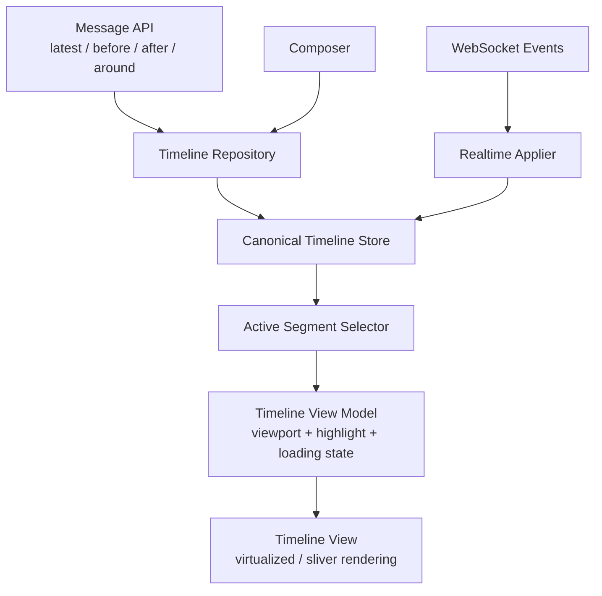

# Canonical Message Timeline

This document defines the long-term message timeline model shared by the PWA and Flutter clients. The goal is to make ordering, pagination, realtime delivery, optimistic sends, and jump-to-message behavior predictable across clients.

## Context

The PWA currently stores message history as a bounded list of windows per chat. One window is active, and the UI renders only that active window. Older/newer fetches mutate the active window, while websocket and optimistic messages are inserted into the chronologically latest window.

The backend message id is a snowflake-style id. It is unique and globally ordered, and the API supports pagination by message id anchors such as `before`, `after`, and `around`.

## Problems To Solve

- Message storage should not depend on which slice is currently rendered.
- Websocket messages should not make a historical active view internally inconsistent.
- Loading newer history after a live websocket message should not render messages out of order.
- Optimistic messages should not be mixed into canonical server-backed ranges.
- Jump-to-message, unread boundary, pin, permalink, and thread navigation should use the same range model.
- Both clients should have the same vocabulary and test cases for timeline behavior.

## Target Architecture



The canonical store owns message ranges and delivery state. The view model owns viewport state, active mode, highlights, loading indicators, and scroll commands.

## Core Types

```ts
type ConversationIdentity = {
  chatId: string;
  threadRootId?: string | null;
};

type ConversationTimeline = {
  identity: ConversationIdentity;
  segments: CanonicalSegment[];
  optimisticMessages: TimelineMessage[];
  pendingLiveMessageIds: string[];
  hasReachedOldest: boolean;
  hasReachedLatest: boolean;
};

type CanonicalSegment = {
  messages: TimelineMessage[];
  firstServerMessageId: string;
  lastServerMessageId: string;
};

type TimelineMessage = {
  serverMessageId?: string | null;
  clientGeneratedId: string;
  createdAt: string;
  deliveryState: 'sending' | 'failed' | 'confirmed' | 'editing' | 'deleting';
  // plus sender, content, attachments, reactions, threadInfo, replyToMessage, etc.
};

type ActiveTimelineSegment = {
  messages: TimelineMessage[];
  canLoadOlder: boolean;
  canLoadNewer: boolean;
  isLatest: boolean;
};
```

## Store Invariants

- Server-backed messages are sorted ascending by snowflake message id.
- Canonical segments are sorted by `firstServerMessageId`.
- Canonical segments are non-empty.
- Canonical segments do not overlap.
- Adjacent or overlapping fetched ranges are normalized into stable segments.
- A server-backed message appears at most once across all canonical segments.
- Optimistic messages stay outside canonical segments until confirmed.
- `clientGeneratedId` is required for optimistic reconciliation.
- A confirmed server message with a matching `clientGeneratedId` removes the corresponding optimistic message.
- Viewport state is not stored in canonical timeline state.
- The active rendered slice is derived from canonical state, not used as the primary storage location.

## Ordering Rules

The ordering source of truth is `serverMessageId`.

For server-backed messages:

1. Compare snowflake `serverMessageId`.
2. If equal, treat as the same logical server message.

For optimistic messages:

1. Keep them in insertion order in `optimisticMessages`.
2. Render them after the latest canonical message only when the active slice is latest.
3. Reconcile by `clientGeneratedId` when a server-backed message arrives.

`createdAt` is display metadata. It should not drive canonical ordering except as a defensive fallback for local-only rows before confirmation.

## Pagination Contract

The backend API uses snowflake message ids as anchors:

- `latest`: fetch the latest page for a chat or thread.
- `before: messageId`: fetch older messages strictly before the anchor.
- `after: messageId`: fetch newer messages strictly after the anchor.
- `around: messageId`: fetch a page centered around or near a target message.

If the backend continues to expose fields named `nextCursor` and `prevCursor`, clients should treat them consistently:

- If cursors are message ids, prefer naming them as message id anchors in client code.
- If cursors ever become opaque, clients must store and replay the returned cursor values instead of deriving anchors from rendered messages.

## Operations

### `refreshLatest(limit)`

Fetches the latest page and inserts it as the latest canonical segment.

Behavior:

- Normalize overlap with existing segments.
- Mark `hasReachedLatest = true`.
- Mark `hasReachedOldest = true` if the response has no older page.
- Keep unrelated older segments if they do not overlap.
- Preserve optimistic messages whose `clientGeneratedId` is not present in the fetched page.

### `insertAround(targetMessageId, messages)`

Stores a segment around a target message.

Used for:

- unread boundary navigation
- pin navigation
- permalink navigation
- reply quote navigation
- thread root or reply jumps

Behavior:

- Ignore the response if it does not contain the target message.
- Normalize overlap with existing segments.
- Select an active segment mode pointing at `targetMessageId`.
- Mark `hasReachedLatest = true` if the response has no newer page.
- Mark `hasReachedOldest = true` if the response has no older page.

### `insertBeforeAnchor(anchorMessageId, messages)`

Loads older history before the first server-backed message in the active segment.

Behavior:

- Incoming messages must all be `< anchorMessageId`.
- Normalize overlap with existing segments.
- Preserve the current active segment mode.
- Mark `hasReachedOldest = true` if the response has no older page.

### `insertAfterAnchor(anchorMessageId, messages)`

Loads newer history after the last server-backed message in the active segment.

Behavior:

- Incoming messages must all be `> anchorMessageId`.
- Normalize overlap with existing segments.
- If no newer page remains, mark `hasReachedLatest = true`.
- If this closes the gap to the latest segment, merge the ranges.

### `applyRealtimeMessage(message)`

Applies a websocket-created message.

Behavior:

- If `clientGeneratedId` matches an optimistic message, confirm it.
- If the timeline has reached latest, insert into the latest canonical segment by `serverMessageId`.
- If the timeline has not reached latest, do not mutate historical segments. Track the message as pending live state instead.
- If the message id already exists in any segment, update that message rather than duplicating it.

### `confirmOptimistic(clientGeneratedId, serverMessage)`

Confirms a local send.

Behavior:

- Remove the matching optimistic message.
- Insert or update the server-backed message in the latest canonical segment if latest is loaded.
- If latest is not loaded, clear the optimistic row and increment pending live state or trigger latest recovery.

### `markOptimisticFailed(clientGeneratedId)`

Marks a failed local send without deleting it.

Behavior:

- Keep the row visible with `deliveryState = 'failed'`.
- Preserve the same `clientGeneratedId` for retry.
- Let the composer or message action layer offer retry and discard actions.

## Realtime While Browsing History

When the user is viewing an older or around segment, incoming websocket messages should not be silently inserted into that rendered segment. They represent newer live state, not part of the historical context.

Expected behavior:

- Keep the user in the historical context.
- Increment pending live state.
- Show a jump-to-latest affordance when appropriate.
- On jump to latest, fetch or activate the latest segment and reconcile pending live messages.

This avoids mixing “current live tail” and “historical active slice” in the same rendered list.

## Rendering Contract

Rendering receives an `ActiveTimelineSegment`, not the entire canonical timeline.

Latest mode:

- Render the latest canonical segment.
- Append unreconciled optimistic messages.
- Auto-scroll only if the viewport was already near bottom.

Around mode:

- Render the segment containing the target message.
- Preserve the target or unread boundary anchor.
- Show load older/newer affordances based on the segment's position and reach flags.
- Do not append optimistic messages unless the active segment is latest.

The view model owns:

- active mode: latest or around target id
- loading older/newer flags
- viewport facts: near top, near bottom, first/last visible message
- highlight state
- scroll commands
- pending live count presentation

## PWA Migration Plan

1. Harden current reducers.
   - Sort after `appendMessages`.
   - Sort after latest refresh merges.
   - Clear loading state when stale generation checks reject a response.

2. Introduce canonical timeline types beside the existing `messagesSlice`.
   - Keep current selectors working.
   - Add conversion from the existing active window shape to an active segment.

3. Move fetch reducers to canonical operations.
   - Replace `pushWindow` with `insertAround`.
   - Replace `prependMessages` with `insertBeforeAnchor`.
   - Replace `appendMessages` with `insertAfterAnchor`.
   - Replace `refreshLatest` with canonical `refreshLatest`.

4. Move websocket handling to canonical operations.
   - Reconcile by `clientGeneratedId`.
   - Insert by `serverMessageId`.
   - Track pending live state when latest is not active or not loaded.

5. Separate viewport state from message storage.
   - Keep scroll anchors and active mode in the page/view model layer.
   - Keep canonical ranges in the store.

## Test Matrix

Shared behavior tests should cover these cases in both clients:

- latest refresh into an empty timeline
- older page inserted before active segment
- newer page inserted after active segment
- around page overlapping an existing segment
- around page disjoint from latest segment
- websocket message while latest is loaded
- websocket message while browsing historical segment
- websocket echo confirming an optimistic message
- API confirmation racing with websocket echo
- failed optimistic send and retry
- delete/update/reaction events for messages in loaded segments
- jump to latest after pending live messages
- gap closure between active historical segment and latest segment

The expected output for each test should be canonical timeline state: segments, optimistic messages, reach flags, and pending live state. Viewport behavior should be tested separately.
