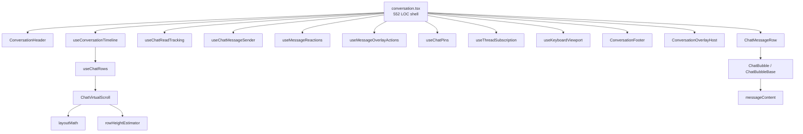
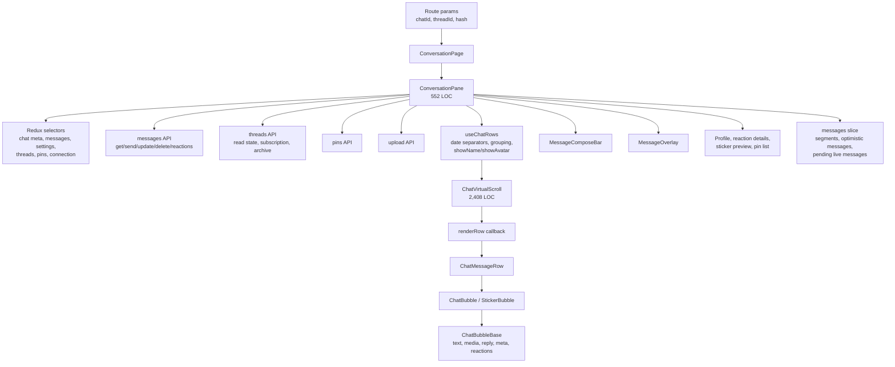
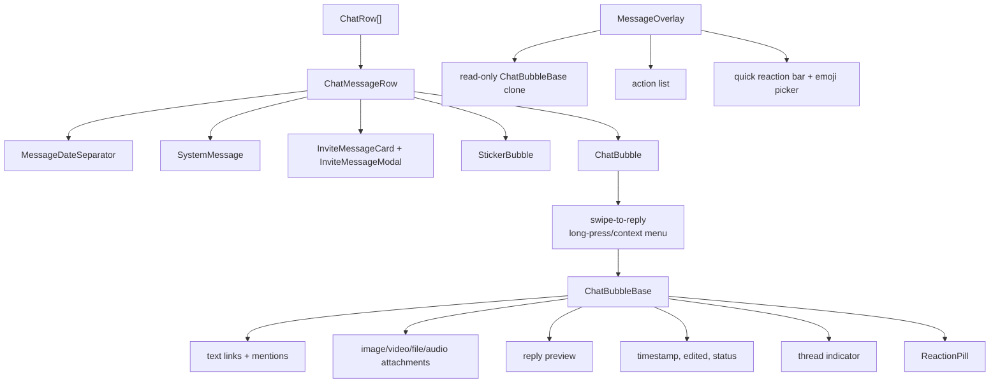
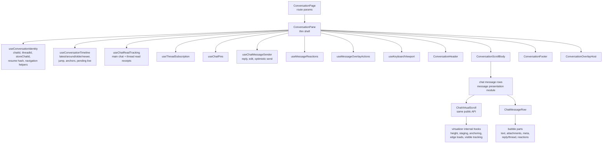
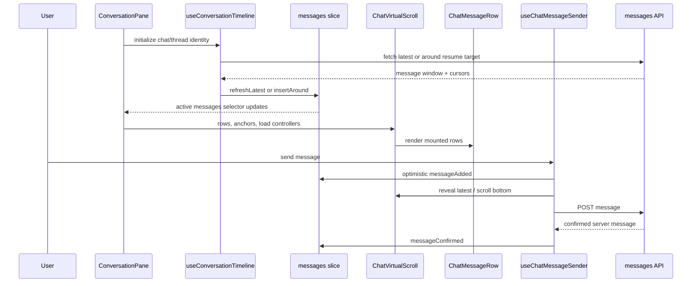

# Conversation Modularization Architecture

Status: first refactor pass implemented; remaining cleanup plan retained
Scope: React PWA conversation, virtual scroll, and message bubble rendering
Primary files:

- `src/pages/conversation/conversation.tsx`
- `src/components/chat/virtualScroll/**`
- `src/components/chat/messages/**`
- `src/components/chat/compose/**`
- `src/store/messages/**`

## Summary

The conversation experience originally worked through a large page component plus two large rendering subsystems:

- `conversation.tsx` is the product orchestration layer, but it has grown into a 552 line component.
- `ChatVirtualScroll.tsx` is a chat-specific virtualizer with a useful public API, but its internals are a 2,408 line component.
- `ChatBubbleBase.tsx` is the main regular-message renderer and is 547 lines.

The immediate cleanup goal is not to redesign chat behavior. The goal is to preserve the current behavior while making the code easier to reason about, test, and change. The safest path is a staged extraction:

1. Keep routing and page identity in `conversation.tsx`.
2. Extract page behavior into hooks with explicit contracts.
3. Keep `ChatVirtualScroll`'s public API stable while splitting its internals.
4. Move row modeling out of `virtualScroll` because it is message presentation logic.
5. Split message bubble rendering into smaller presentation components.
6. Add tests before extracting the behavior that can regress scroll, read state, optimistic sends, or overlay actions.

## Implemented First Pass

This pass keeps behavior intentionally conservative while cutting the largest page file down to a reviewable shell:

| Area                 | Before                                   | After                                                                                              |
| -------------------- | ---------------------------------------- | -------------------------------------------------------------------------------------------------- |
| Conversation page     | `conversation.tsx`, 552 LOC             | `conversation.tsx`, 552 LOC, delegates behavior to focused hooks/components.                        |
| Timeline/read state  | Inline in `conversation.tsx`              | `useConversationTimeline`, `useChatReadTracking`.                                                    |
| Sending/upload       | Inline in `conversation.tsx`              | `useChatMessageSender`.                                                                            |
| Overlay/reactions    | Inline action and reaction handlers      | `overlayActionPolicy`, `useMessageOverlayActions`, `useMessageReactions`.                          |
| Header/footer/modals | Inline JSX in page                       | `ConversationHeader`, `ConversationFooter`, `ConversationOverlayHost`.                                   |
| Virtual scroll       | Math and estimation helpers in component | `layoutMath`, `rowHeightEstimator`; public `ChatVirtualScroll` API unchanged.                      |
| Bubble text content  | Link/mention renderer in base bubble     | `messageContent` renderer; `ChatBubbleBase` remains responsible for bubble layout/media/reactions. |

Implemented module map:



The deeper virtualizer state-machine split and finer-grained bubble media/chrome split remain planned follow-ups. They are intentionally not mixed with this page extraction so scroll anchoring and message rendering can be reviewed independently.

## Pre-Refactor Architecture Observations



### `conversation.tsx`

The page currently owns these responsibilities:

| Concern              | Current owner                              | Notes                                                                            |
| -------------------- | ------------------------------------------ | -------------------------------------------------------------------------------- |
| Route identity       | `ConversationPage`, `ConversationPane`         | Reads `chatId`, optional `threadId`, resume hash, history.                       |
| Store identity       | `conversation.tsx`                          | Builds `storeChatId` for main chat vs thread.                                    |
| Chat metadata        | `conversation.tsx`                          | Fetches group info, mute state, role state.                                      |
| Timeline loading     | `conversation.tsx`                          | Fetches latest, around, older, newer windows and dispatches timeline reducers.   |
| Scroll anchors       | `conversation.tsx`                          | Owns `initialAnchor`, scroll API ref, jump-to-message behavior.                  |
| Read receipts        | `conversation.tsx`                          | Main chat and thread read timers are inline.                                     |
| Floating date        | `conversation.tsx` plus `ChatVirtualScroll` | Page formats labels; virtualizer detects collision.                              |
| Scroll-to-bottom FAB | `conversation.tsx`                          | Mixes unread count, pending live count, direction, and latest recovery.          |
| Thread subscription  | `conversation.tsx`                          | Fetches and mutates subscribed/archive state.                                    |
| Pins                 | `conversation.tsx` plus pin components      | Loads pins and builds pin/unpin overlay actions.                                 |
| Reply/edit state     | `conversation.tsx`                          | Manages `replyingTo`, `editingSession`, compose focus.                           |
| Sending              | `conversation.tsx`                          | Text, sticker, and audio optimistic send flows are inline.                       |
| Reactions            | `conversation.tsx`                          | Optimistic reaction mutation and recent reaction tracking are inline.            |
| Overlay actions      | `conversation.tsx`                          | Builds copy, save, favorite, reply, thread, edit, delete, pin, reaction details. |
| Modals               | `conversation.tsx`                          | Owns profile, reaction detail, sticker preview, and pin list state.              |
| Render composition   | `conversation.tsx`                          | Header, `IonContent`, virtual scroll, footer, modals, overlay host.              |

The page is therefore both a screen component and a controller for timeline, read state, sending, actions, and overlays.

### `ChatVirtualScroll`

`ChatVirtualScroll` has a clear external contract but very dense internals.

Current public inputs:

- `rows`
- `renderRow`
- `initialAnchor`
- `scrollApiRef`
- `loadOlder`
- `loadNewer`
- `topOverlay`
- visibility and scroll callbacks

Current internal responsibilities:

| Concern          | Description                                                                 |
| ---------------- | --------------------------------------------------------------------------- |
| Height model     | Fenwick tree, height cache, estimated heights, exact measured heights.      |
| Mounted window   | Bounded rendered range with top and bottom spacers.                         |
| Staging          | Hidden staging lane for measuring rows before promotion.                    |
| Phase machine    | `WAITING_VIEWPORT`, `BOOTSTRAP`, `READY`, `RECENTERING`.                    |
| Scroll anchoring | Preserves position during prepend, append, jump, and height correction.     |
| Edge loading     | Calls parent `loadOlder.onLoad` and `loadNewer.onLoad` at scroll edges.     |
| Imperative API   | `scrollToBottom`, `scrollToItem`, `scrollToMessageId`.                      |
| Visible tracking | First visible message, last fully visible message, floating-date collision. |
| Rendering        | Container, spacers, mounted rows, staging rows, hints, overlays.            |

Healthy boundaries:

- The parent owns network loading.
- The virtualizer owns scroll geometry.
- Message rendering stays outside the virtualizer through `renderRow`.
- Low-level files such as `fenwick.ts`, `heightCache.ts`, `MeasuredRow.tsx`, and `useStagingBatch.ts` are focused.

Leaky boundaries:

- `ChatRow` and `useChatRows` live under `virtualScroll`, but they encode message presentation rules.
- Row keys depend on implicit `msg:` conventions that the virtualizer uses for mutation classification.
- `initialAnchor` requires the parent to bump a token for intentional re-anchors.
- Floating date collision depends on page CSS class names and a virtualizer callback.
- `ChatVirtualScroll` reads Redux font settings directly, which makes it less reusable and harder to test.
- Legacy unused virtual-scroll hooks still exist in the folder and make the architecture look split when it is not.

### Message Rendering



Existing rendering boundaries are useful:

- `ChatMessageRow` chooses date/system/invite/sticker/regular rows.
- `ChatBubble` owns gesture plumbing.
- `ChatBubbleBase` owns regular bubble content.
- `StickerBubble` owns sticker-specific display.
- `MessageOverlay` owns portal positioning and cloned bubble UI.
- Media preview components are already separate under `messages/media`.

The main coupling issue is that action policy and mutation policy still live in the page. Rendering components show affordances, but the page owns all of the decisions and side effects.

Examples:

- `ChatMessageRow` receives page callbacks for reply, jump-to-reply, long press, avatar click, thread click, reaction toggle, and sticker tap.
- `MessageOverlay` renders actions, but `conversation.tsx` decides which actions exist and runs every side effect.
- Reaction display is in bubble components, quick reaction UI is in overlay, reaction mutation is in the page, and reaction detail fetching is in a modal.
- Optimistic attachment preview object URLs are created in the page, while attachment display lives in the bubble renderer and upload UI lives in compose.

## Target Architecture

The target keeps the route page thin and moves behavior into named hooks/controllers.



### Target Module Layout

This is a proposed structure, not a required exact path list.

```text
src/pages/conversation/
  conversation.tsx
  ConversationHeader.tsx
  ConversationScrollBody.tsx
  ConversationFooter.tsx
  ConversationOverlayHost.tsx
  hooks/
    useConversationIdentity.ts
    useConversationTimeline.ts
    useChatReadTracking.ts
    useThreadSubscription.ts
    useChatPins.ts
    useChatMessageSender.ts
    useMessageOverlayActions.ts
    useKeyboardViewport.ts
  utils/
    conversationIds.ts
    messageDrafts.ts
    optimisticMessages.ts
    overlayActionPolicy.ts

src/components/chat/messages/
  rows/
    types.ts
    useChatRows.ts
    rowPredicates.ts
  presentation/
    messageViewModel.ts
    messagePredicates.ts
  bubble/
    ChatBubble.tsx
    ChatBubbleBase.tsx
    BubbleChrome.tsx
    BubbleText.tsx
    BubbleAttachments.tsx
    BubbleMeta.tsx
    ReplyPreview.tsx
    ThreadIndicatorSlot.tsx
    BubbleReactions.tsx

src/components/chat/virtualScroll/
  ChatVirtualScroll.tsx
  types.ts
  useHeightModel.ts
  useMountedWindow.ts
  useStagingPipeline.ts
  useScrollAnchoring.ts
  useVisibleMessageTracking.ts
  useEdgeLoadTriggers.ts
  useImperativeScrollApi.ts
  fenwick.ts
  heightCache.ts
  MeasuredRow.tsx
```

### What Stays In `conversation.tsx`

`conversation.tsx` should remain the place where the route becomes a screen.

Keep:

- `useParams`, `useHistory`, and route-level back action.
- `chatId`, `threadId`, `storeChatId`, and keying/remount identity.
- Top-level selection of current user and chat/thread identity.
- Wiring between extracted hooks and render components.
- `ChatContext.Provider`, unless that context is replaced deliberately.

Do not keep:

- Raw message API pagination details.
- Read-receipt timer logic.
- Optimistic send construction.
- Overlay action assembly.
- Pin/thread subscription side effects.
- Keyboard viewport bookkeeping.
- Long inline render blocks for header/body/footer/overlay.

## Proposed Hooks And Contracts

### `useConversationTimeline`

Owns timeline fetches and scroll anchors.

Inputs:

- `chatId`
- `threadId`
- `storeChatId`
- `initialResumeMessageId`
- `lastReadMessageId`
- `showToast`

Outputs:

- `messages`
- `messageLookup`
- `chatRows` or row inputs
- `initialAnchor`
- `canLoadOlder`
- `canLoadNewer`
- `pendingLiveCount`
- `loadingOlder`
- `loadingNewer`
- `loadOlder`
- `loadNewer`
- `jumpToMessage`
- `scrollToAbsoluteBottom`
- `revealLatestAfterSend`

Important constraints:

- Preserve generation checks around async loads.
- Preserve `around` semantics for resume, pin, permalink, and reply jumps.
- Preserve the difference between browsing history and viewing the latest tail.
- Avoid reading raw `state.messages.chats[storeChatId]` from the page.

### `useChatReadTracking`

Owns main chat and thread read state.

Inputs:

- `chatId`
- `threadId`
- `lastFullyVisibleMessageId`
- `lastReadMessageId`
- `atBottom`
- `initialResumeMessageId`

Outputs:

- no UI output initially, only side effects
- optionally `flushReadTracking` for page visibility callbacks

Important constraints:

- Keep cooldown behavior explicit.
- Preserve the separate main-chat and thread read APIs.
- Do not mark read while the page is hidden.
- Add tests before extracting because timer behavior is easy to regress.

### `useChatMessageSender`

Owns text, edit, sticker, and audio sends.

Inputs:

- `chatId`
- `threadId`
- `storeChatId`
- current user summary
- `replyingTo`
- `editingSession`
- `messageLookup`
- `revealLatestAfterSend`
- `showToast`
- callbacks to clear reply/edit state

Outputs:

- `handleSend`
- `uploadAttachment`
- `startEditingMessage`
- `requestEditLastOwnMessage`
- `editingSession`
- `replyingTo`
- setters or command methods for reply/edit

Important constraints:

- Collapse duplicated optimistic construction across text, sticker, and audio.
- Ensure object URLs are revoked.
- Keep `clientGeneratedId` as the reconciliation key.
- Preserve thread vs main chat read updates after send confirmation.
- Preserve failed-send behavior until a separate product decision changes it.

### `useMessageReactions`

Owns optimistic reaction mutation.

Inputs:

- `chatId`
- `dispatch`
- `showToast`

Outputs:

- `handleReactionToggle`
- quick reaction emoji list, or leave quick reaction selection in settings hook

Important constraints:

- Enforce the maximum reactions per user.
- Update recent reactions after adding.
- Prefer a future rollback/error surface for failed API calls.

### `useMessageOverlayActions`

Owns long-press action policy and handlers.

Inputs:

- `chatId`
- `threadId`
- `currentUserId`
- `isAdmin`
- `savedMessagesEnabled`
- `pins`
- `overlayMessage`
- navigation helpers
- reply/edit/pin/reaction/profile callbacks
- alert/toast services

Outputs:

- `overlayActions`

Important constraints:

- Keep `MessageOverlay` UI-only.
- Make action availability testable without rendering the full page.
- Separate pure action eligibility from side-effect handlers where practical.

### `useThreadSubscription`

Owns thread subscription/archive state.

Inputs:

- `chatId`
- `threadId`
- alert/toast or alert-only service

Outputs:

- `threadSubscribed`
- `threadArchived`
- `threadSubLoading`
- `handleToggleThreadSubscription`

Important constraints:

- Keep optimistic subscription update on thread reply.
- Preserve Redux synchronization with `threadsSlice`.
- Refresh thread list after subscribing to a thread.

### `useChatPins`

Owns pin loading and pin/unpin command helpers.

Inputs:

- `chatId`
- `threadId`
- `isAdmin`
- toast/alert services

Outputs:

- `pins`
- `pinsLoaded`
- `pinListOpen`
- `setPinListOpen`
- `createPinAction`
- `deletePinAction`

Important constraints:

- Main chat only.
- Keep pin state available for the banner and overlay action policy.

## Virtual Scroll Cleanup

The virtualizer should be split internally after its public contract is locked down. The parent API should stay stable through the first pass.

### Preserve Public API

Keep:

- `rows`
- `renderRow`
- `initialAnchor`
- `scrollApiRef`
- `loadOlder`
- `loadNewer`
- `topOverlay`
- `bottomPadding`
- visibility callbacks

Document:

- row key requirements
- anchor token semantics
- `scrollToMessageId`
- parent-owned loading contract
- how load callbacks should signal completion/failure
- floating overlay measurement contract

### Split Internal Hooks

| Hook                        | Responsibility                                                                                      |
| --------------------------- | --------------------------------------------------------------------------------------------------- |
| `useHeightModel`            | Height cache, Fenwick tree, estimates, `offsetOf`, `indexAtOffset`, `totalHeight`, measured checks. |
| `useStagingPipeline`        | Hidden staging batches, measurement commit, pending batch state.                                    |
| `useMountedWindow`          | Mounted range, desired range derivation, top/bottom spacer heights.                                 |
| `useScrollAnchoring`        | Prepend/append/reset detection, anchor capture, restore, drift checks.                              |
| `useVisibleMessageTracking` | First visible, last fully visible, top-date collision.                                              |
| `useEdgeLoadTriggers`       | Top/bottom load arming and rearming, edge idle behavior.                                            |
| `useImperativeScrollApi`    | `scrollToBottom`, `scrollToItem`, `scrollToMessageId`.                                              |
| `useVirtualizerPhase`       | Bootstrap, ready, recentering state transitions.                                                    |

### Dead Or Legacy Code

Before or during virtualizer decomposition, confirm and remove unused legacy files:

- `src/components/chat/virtualScroll/useCoreManager.ts`
- `src/components/chat/virtualScroll/useMountedWindow.ts`
- `src/components/chat/virtualScroll/useScrollPreservation.ts`

Also remove type exports and helper methods that only exist for those legacy files after import checks confirm no live use.

## Message Bubble Cleanup

`ChatBubbleBase` can be split without changing visible behavior.

Recommended subcomponents:

| Component/helper    | Responsibility                                                 |
| ------------------- | -------------------------------------------------------------- |
| `BubbleText`        | Text, links, invite links, permalinks, mentions.               |
| `BubbleAttachments` | Image/video/file/audio attachment dispatch.                    |
| `BubbleMediaGrid`   | Single media and justified gallery wrapper.                    |
| `ReplyPreview`      | Shared reply preview display for regular and sticker bubbles.  |
| `BubbleMeta`        | Timestamp, edited marker, sent/confirmed status.               |
| `BubbleChrome`      | Shared avatar, sender header, wrapper, hover reply affordance. |
| `BubbleReactions`   | Reaction pill list and mutation callback wiring.               |
| `useBubbleGestures` | Swipe-to-reply, long press, context menu.                      |

Centralize predicates and helpers:

- `isSystemMessage`
- `isInviteMessage`
- `isStickerMessage`
- `isImageAttachment`
- `isVideoAttachment`
- `formatMessageTime`
- `measureMessageLayout`

## Data Flow After Cleanup



## Testing Plan

The cleanup should increase test coverage as behavior moves out of the page.

### Existing Coverage To Keep

- `src/store/messages/*.test.ts`
- `src/components/chat/virtualScroll/ChatVirtualScroll.dom.test.tsx`
- Existing API helper and search tests

### Add Before Risky Extractions

| Area                  | Suggested tests                                                                                        |
| --------------------- | ------------------------------------------------------------------------------------------------------ |
| Timeline hook         | latest load, around load, older/newer load, failed load toast, generation stale response ignored.      |
| Jump/resume           | target already loaded, target fetched by `around`, target not found, hash clearing only after handled. |
| Read tracking         | main chat cooldown, thread read cooldown, hidden page skip, visibility flush.                          |
| Send controller       | text/sticker/audio optimistic add, confirmation, failure patch, edit rollback, object URL revoke.      |
| Reactions             | limit enforcement, optimistic add/remove, recent reaction update, failed API behavior.                 |
| Overlay actions       | action availability matrix for own/admin/deleted/sticker/audio/thread/pinned/saved-message states.     |
| Row model             | date separators, sender grouping, system rows, stable keys for optimistic confirmation.                |
| Bubble rendering      | deleted text, reply preview, mention click, media-only timestamp, attachment gallery dispatch.         |
| Virtualizer internals | height model, mutation classification, mounted range derivation, edge rearm, imperative scroll target. |

### Test Layer Guidance

- Use unit tests for pure helpers and action eligibility.
- Use DOM Vitest tests for hooks/components with browser globals.
- Use browser tests only for real viewport/Ionic behavior that happy-dom cannot model.
- Run `npm run verify` after source changes. For documentation-only changes, at least verify file links and markdown structure locally.

## Staged Cleanup Plan

### Phase 0: Documentation And Contract Alignment

Goal: make the intended boundaries explicit before moving code.

Tasks:

1. Keep this document updated as the cleanup plan.
2. Update `VirtualScroll.md` so it matches current code:
   - anchor type is `message`, not `item`
   - public handle includes `scrollToMessageId`
   - height estimate caps match implementation or implementation is changed to match doc
3. Add a short contract section to virtual scroll types or docs for row keys and anchor tokens.

### Phase 1: Low-Risk Page Extractions

Goal: shrink `conversation.tsx` without touching timeline or send behavior.

Tasks:

1. Move pure helpers to `utils/`:
   - client id generation
   - message id comparison
   - attachment id comparison
   - optimistic uploaded attachment conversion
   - reply preview snapshot construction
2. Extract `useThreadSubscription`.
3. Extract `useChatPins`.
4. Extract `useKeyboardViewport`.
5. Split render-only shell components:
   - `ConversationHeader`
   - `ConversationFooter`
   - `ConversationOverlayHost`

Expected result:

- Page remains behaviorally identical.
- Page LOC drops meaningfully.
- Hooks have narrow inputs and outputs.

### Phase 2: Action And Reaction Policy

Goal: make message actions testable outside the page.

Tasks:

1. Extract pure action eligibility helpers.
2. Extract `useMessageReactions`.
3. Extract `useMessageOverlayActions`.
4. Add an action matrix test suite.
5. Keep `MessageOverlay` as a presentation component.

Expected result:

- Overlay action behavior can be reviewed without reading the whole page.
- Reaction policy is no longer duplicated across row and overlay callers.

### Phase 3: Timeline And Read Tracking

Goal: isolate scroll-driven timeline behavior behind explicit contracts.

Tasks:

1. Add tests for jump/resume and read tracking behavior.
2. Extract `useChatReadTracking`.
3. Extract `useConversationTimeline`.
4. Remove page reads of raw message slice internals.
5. Keep `ChatVirtualScroll` public API unchanged.

Expected result:

- Page knows what timeline commands are available, not how timeline windows are fetched or normalized.
- Read receipt behavior is testable.

### Phase 4: Send Controller

Goal: collapse duplicated send logic while preserving optimistic behavior.

Tasks:

1. Add tests for text, sticker, audio, edit, failure, and revoke behavior.
2. Extract optimistic message builders.
3. Extract `useChatMessageSender`.
4. Share confirmation/read-update helpers across message kinds.
5. Keep product behavior unchanged unless a separate decision changes failed-send UX.

Expected result:

- The largest duplicated block leaves the page.
- Optimistic send semantics become testable and easier to compare with Flutter/backend contracts.

### Phase 5: Virtual Scroll Internal Decomposition

Goal: preserve `ChatVirtualScroll` as the public component while splitting the engine.

Tasks:

1. Add focused tests for pure geometry and mutation helpers as they are extracted.
2. Move height model first.
3. Move staging pipeline.
4. Move visible-message tracking.
5. Move edge load triggers.
6. Move imperative API.
7. Move scroll anchoring and phase transitions only after coverage exists.
8. Delete confirmed-dead legacy virtual-scroll files.

Expected result:

- `ChatVirtualScroll.tsx` becomes an orchestrator instead of the whole engine.
- Geometry, staging, and anchoring can be reasoned about independently.

### Phase 6: Bubble Rendering Decomposition

Goal: split rendering by visual responsibility while preserving DOM behavior.

Tasks:

1. Extract shared bubble chrome used by regular and sticker bubbles.
2. Extract text/link/mention rendering.
3. Extract attachment rendering.
4. Extract metadata/status rendering.
5. Extract gesture hook from `ChatBubble`.
6. Add component tests for key message states.

Expected result:

- Bubble rendering changes no longer require editing a 500+ line component.
- Regular and sticker bubbles share common chrome instead of duplicating it.

## Risk Matrix

| Area                     | Risk       | Why                                                                                | Mitigation                                                              |
| ------------------------ | ---------- | ---------------------------------------------------------------------------------- | ----------------------------------------------------------------------- |
| Timeline loading         | High       | Anchor, cursor, generation, and active segment behavior are tightly coupled.       | Add tests before extraction; preserve reducer contracts.                |
| Read receipts            | High       | Timer and visibility behavior can silently regress.                                | Use fake timers and explicit hidden/visible tests.                      |
| Send controller          | High       | Optimistic rows, confirmation, read state, and object URL cleanup are intertwined. | Extract builders first; test every payload kind.                        |
| Virtual scroll anchoring | High       | Scroll position bugs are visual and intermittent.                                  | Extract pure helpers first; keep public API stable; add viewport tests. |
| Overlay actions          | Medium     | Lots of permission/action branches, but mostly discrete.                           | Pure eligibility tests plus handler smoke tests.                        |
| Thread subscription      | Medium-low | Isolated to thread header and threads slice.                                       | Extract early; keep alert behavior unchanged.                           |
| Pins                     | Medium     | Shared by banner, overlay actions, and modal.                                      | Extract loading/actions but keep UI props stable.                       |
| Bubble split             | Medium     | Visual regressions possible.                                                       | Component tests plus manual visual smoke path.                          |

## Definition Of Done

The cleanup can be considered complete when:

- `conversation.tsx` is a thin page shell with route/layout wiring and hook composition.
- Timeline, read tracking, sending, reactions, overlay actions, pins, thread subscription, and keyboard viewport behavior live in named hooks.
- `ChatVirtualScroll.tsx` is an orchestrator with internal hooks for height, staging, anchoring, edge loads, visible tracking, and imperative API.
- Message row modeling no longer lives under `virtualScroll`.
- `ChatBubbleBase` is split into focused rendering components.
- Dead virtual-scroll compatibility files are removed.
- Current behavior is covered by targeted unit/DOM tests before or during extraction.
- `npm run verify` passes after implementation changes.

## Non-Goals

- Do not change backend API contracts as part of this cleanup.
- Do not redesign visual appearance of chat bubbles.
- Do not change failed-send UX unless explicitly scoped.
- Do not replace the custom virtualizer during this plan.
- Do not move the whole conversation to a new state library.

## Open Questions

1. Should `ChatVirtualScroll` accept `chatFontSizeStyle` as a prop instead of reading Redux directly?
2. Should `LoadController.onLoad` return a promise so the virtualizer can re-arm edge loads after failures?
3. Should row keys become a documented branded type to make the `msg:` convention harder to violate?
4. Should `MessageOverlay` receive a view model rather than raw message props?
5. Should failed optimistic sends stay as deleted-looking rows, or become an explicit failed delivery state?
6. Should thread and main-chat read tracking share one controller or remain separate hooks under one wrapper?

## Related Documents

- `docs/architecture/canonical-message-timeline.md`
- `docs/architecture/frontend-testing-strategy.md`
- `docs/analysis_report/architecture.md`
- `docs/analysis_report/remediation-roadmap.md`
- `docs/analysis_report/modules/03-chat-rendering.md`
- `src/components/chat/virtualScroll/VirtualScroll.md`
